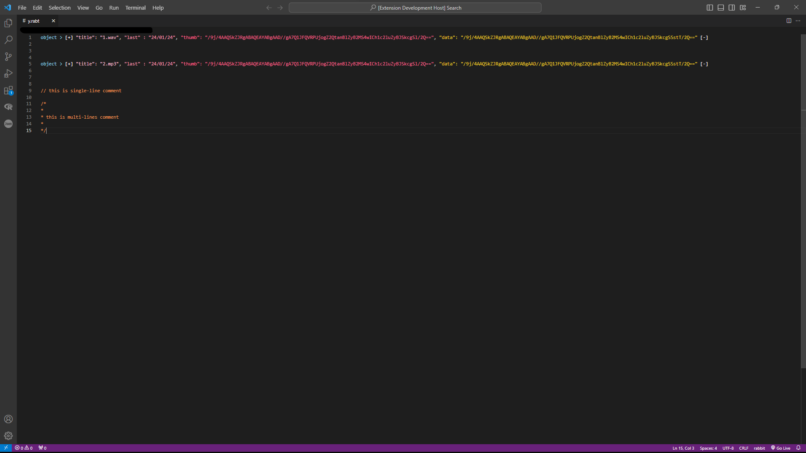

# 
Rabbit Syntax Highlighting for Visual Studio Code

  

 

## Overview
- Elevate your Rabbit coding experience with Rabbit Syntax Highlighting, a Visual Studio Code extension by RabbitTeam. 
- This extension provides vibrant syntax highlighting for the Rabbit language, making your code visually appealing and easy to read.

 

## Features
- Clear Syntax Highlighting: Easily identify and understand different code elements with comprehensive syntax highlighting tailored for the Rabbit language.
- Auto-detection: Rabbit Syntax Highlighting automatically recognizes and highlights Rabbit files with the ".rabt" extension, ensuring a seamless coding experience.
- Theme Support: Customize your coding environment with the included "Rabbit Theme." Achieve a harmonious visual experience that complements the Rabbit language syntax.
- Distinctive Comment Styling: Comments are highlighted with a unique color, ensuring they catch your eye and facilitate clear code documentation.
- Base64-encoded Bytes Support: The "thumb" and "data" values represent Base64-encoded images, allowing seamless inclusion of images directly in your Rabbit code.

 

## Installation
- Open Visual Studio Code.
- Go to the Extensions view: Click on the Extensions icon in the Activity Bar.
- Search for "Rabbit Syntax": Enter "Rabbit Syntax" in the Extensions view search box.
- Install the Extension: Find the extension in the search results and click the "Install" button.

 

## Usage
- Once installed, Rabbit Syntax Highlighting will automatically highlight Rabbit language syntax in your code files with the .rabt extension.

 

## Configuration
- No additional configuration is required.

 

## Screenshots

  

  
 

## License
- This extension is licensed under the MIT License.

  
 

## Contact
- For support or inquiries, feel free to open a new issue ticket.

  
 
